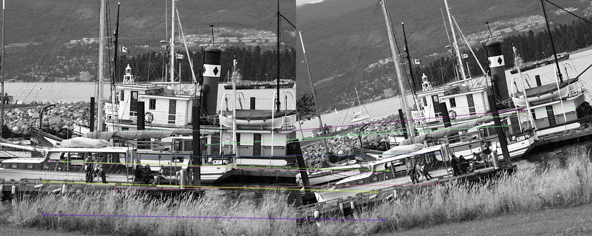
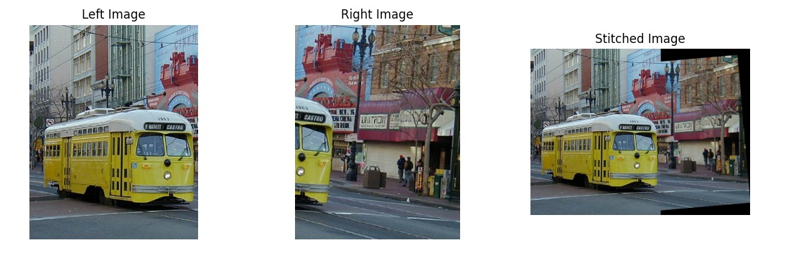

# Image_Stitching

Implementation of Image Stitching algorithm.

This image stitching algorithm first uses the Scale-Invariant Feature Transform (SIFT) and the Brute-Force Matche to determine keypoint matches between two images (these are scale invariant)

This is combined with the RANSAC algorithm to discover the best transformation between images. Two images can consequently be stichted together by transforming one of them to the coordinate space of the other.

